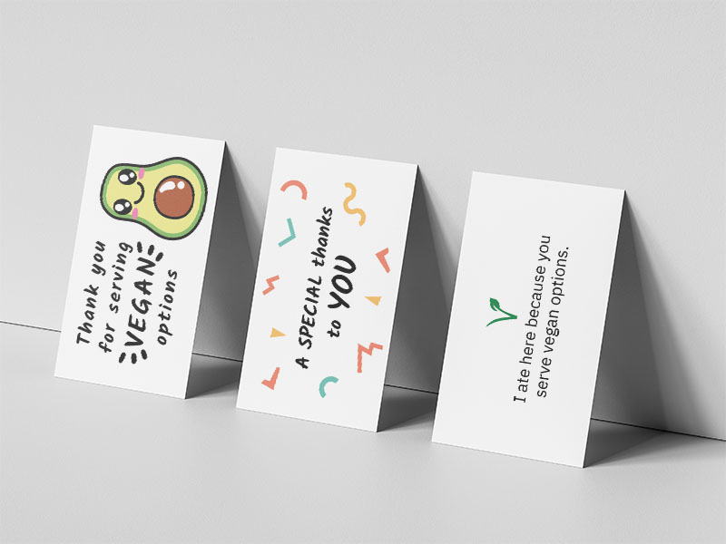

# Vegan thank you notes
Print-ready business card sized thank you notes for you to leave some appreciation at restaurants for having vegan options on the menu.

## Usage

Business cards typically cost very little, making it a very cheap way to leave your message. A stack of 500 pieces with no extra finish can be found for under €20.

1. Pick and choose your favorite version from the [print](print) section.
2. Download the PDF in the size that applies to you since these cards have varying sizes across the globe.
3. Order a stack of standard business cards with the PDF at an online print shop that serves your area.

**Be sure to leave this card with a nice tip!**

*Make sure check if your print shop has corresponding file specifications for their services. The ones in use are quite common and may be found below.*

## Files

The designs are configured according to the following specifications:

- Standard EU size (85 × 55 mm)
- Standard US size (3.5 × 2 inch)
- Bleed of 3 mm
- Safety margin of 4 mm
- CMYK color
- Designer black for opaque black areas (C=70, M=50, Y=30, K=100)
- PDF/X-1a(2001) selected upon export

Example show the standard EU size.

## Sources used

Fonts:

- [Kalam](https://fonts.google.com/specimen/Kalam)
- [IBM Plex Sans](https://fonts.google.com/specimen/IBM+Plex+Sans)

## Contribution

Feel free to fork the repository, make changes according to your wishes and contribute in any way you see fit.